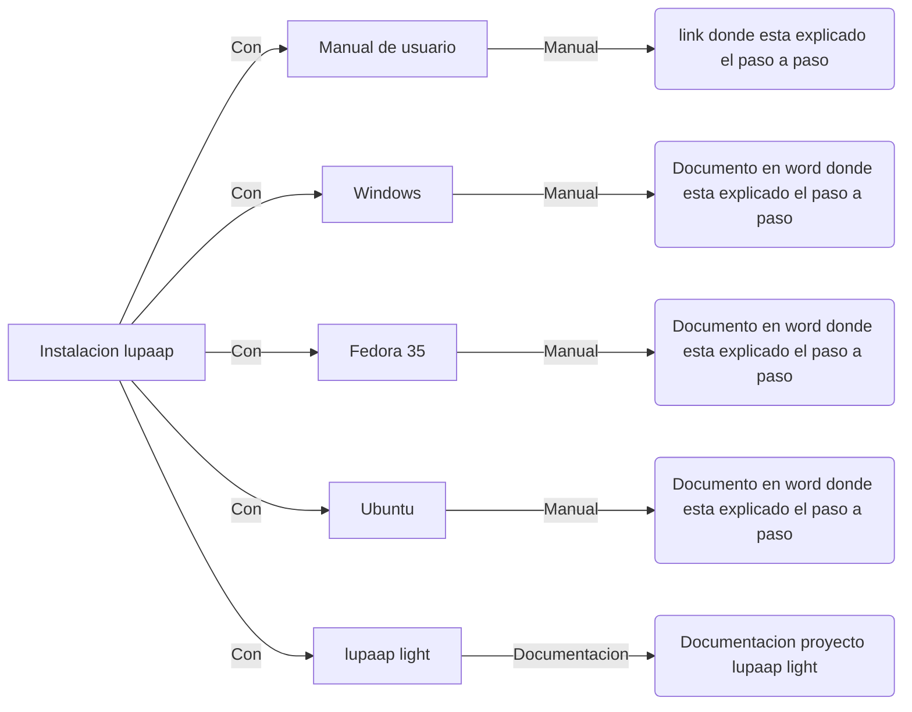

### Bienvenido a Lupaap

Lupaap  es una herramienta de captura de información on-line y off-line (en linea y fuera de linea.) 

● Optimiza los procesos de recolección de datos a través de formularios digitales.

● Cuenta con estadísticas en tiempo real de tu operación en campo y básate en ellas
para tomar decisiones oportunas.

● Optimiza el proceso de gestión documental transformándolo en un proceso casi
inmediato.

● Reduce en un 60% el tiempo de diligenciamiento del formulario.

● Establece escenarios de competencia entre tus empleados y publica en línea los
resultados de los concursos creados por la empresa.

● Capacita a los usuarios y reduce hasta en un 100% los costos de evaluación.

__________________________________________________________________________________________________________________________________________________________________

## UML diagrams

### Manual de usuario

En esta guía aprenderás a instalar Lupaap en tu equipo.
sigue estos sencillos pasos.

En el siguiente link encontrara los pasos a seguir para la instalacion de la app de lupaap:

https://stonly.com/sl/4a9030c0-53d6-46da-817b-bb1e03488856/Steps/

__________________________________________________________________________________________________________________________________________________________________

### Manual de instalacion para windows

En el siguiente manual aprenderas los pasos a seguir para la instalacion en tu equipo con sistema operativo de windows, sin importar cual sea su version:

[Manual.Tecnico.Lupaap.docx](https://github.com/frankn9/lupaap/files/8254614/Manual.Tecnico.Lupaap.docx)

_________________________________________________________________________________________________________________________________________________________________

### Manual de instalacion para fedora 35:

Fedora es una distribución con estrechos vínculos con Red Hat Enteprise Linux, siendo más específicamente su banco de pruebas (pese a ello, Fedora es un sistema
realmente muy capaz en entorno reales), así que las herramientas o componentes para programación juegan un papel importante.

En el siguiente manual aprenderas los pasos a seguir para la instalacion en tu equipo con fedora 35

[Instalación Lupaap FEDORA35(2).docx](https://github.com/frankn9/lupaap/files/8254700/Instalacion.Lupaap.FEDORA35.2.docx)

__________________________________________________________________________________________________________________________________________________________________

###  Proyecto Lupaap light

  #### Introducción
  
  

Este proyecto se desarrollará para mitigar las funcionalidades de Lupaap normal, pero en un entorno nuevo, debido a que el código muy extenso es causa de que los programadores no entiendan o se confundan y demoren al momento de desarrollar y entregar. Se tuvo en cuenta una nueva tecnología para ello.

  ####  Objetivos Generales

Obtener un producto inicialmente, mínimo viable al pasar por control de calidad para posteriormente tener un producto terminado para el cliente. Y se puedan realizar los consumos de los Web Services requeridos entre ellos el Formulario de Vinculación de Productos, CRM y BPO. Además, se contará con un sistema de autenticación con token de seguridad encriptado en sha-1.
El desarrollador podrá desarrollar las Web Services y funcionalidades sin limitaciones de entornos y con un código más entendible con menor nivel de riesgo de impacto negativo en el software.

El en siguiente documento encontrara la documentacion relacionada con este proyecto llamado lupaap light:

[Proyecto Lupaap Light.docx](https://github.com/frankn9/-Instalacion-lupaap/blob/main/Proyeto%20Lupaap%20Light.docx)

